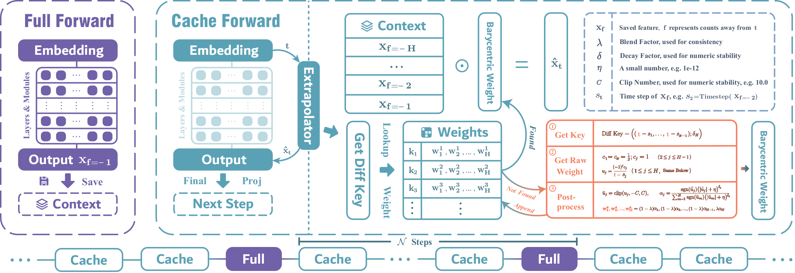

<p align="center">
  
</p>

<h1 align="center">
Memory-Efficient Training-Free Acceleration of Diffusion Transformers with Barycentric Extrapolation
</h1>

<div id="badges" align="center">

[](https://example.com)
[](https://kiramei.github.io/BaryCache/)
[](https://github.com/Kiramei/BaryCache)


</div>

<p align="center">
  
</p>

**BaryCache** is a training-free acceleration method for Diffusion Transformers (DiTs). It forecasts stepwise features with a numerically stable **Barycentric Extrapolator**, reducing redundant denoising computation without the large activation buffers required by blockwise caching methods. Across class-to-image, text-to-image, and text-to-video generation, BaryCache reaches up to **3.30x end-to-end speedup** while retaining strong perceptual quality and a compact memory footprint.

## Highlights

- **Training-free:** works with pretrained DiT models without finetuning.
- **Memory-efficient:** caches a short history of stepwise outputs instead of per-layer or per-module activations.
- **Stable forecasting:** uses clipped, decay-adjusted barycentric weights to suppress Runge-like oscillations.
- **Online decoupling:** precomputes schedule-dependent weights independently of model features.
- **Broad coverage:** implementations for DiT-XL/2, PixArt-Sigma, and HunyuanVideo.

## News

- **2026-08-19:** Code, paper and project page released.
- **2026-08-13:** Paper has been accepted by ICITES 2026. 🎉

## Repository Structure

```text
BaryCache/
|-- DiT-XL-2/             # Class-to-image inference
|-- PixArt-Sigma/         # Text-to-image inference
|-- HunyuanVideo/         # Text-to-video inference
|-- docs/                 # GitHub Pages project site and full-resolution media
`-- README.md
```

Each model directory is self-contained and retains the structure and license of its upstream implementation.

## Installation

Clone the repository:

```bash
git clone https://github.com/Kiramei/BaryCache.git
cd BaryCache
```

Create the environment for the model you want to run.

### DiT-XL/2

```bash
cd DiT-XL-2
conda env create -f environment.yml
conda activate DiT
```

Download the official `DiT-XL-2-256x256.pt` checkpoint and an SD VAE, then set `dit_ckpt_path` and `vae_path` in `sample_barycache.py`.

### PixArt-Sigma

```bash
cd PixArt-Sigma
conda env create -f environment.yml
conda activate PixArt
```

Download the official PixArt-Sigma transformer, VAE, tokenizer, and text encoder. Set `TRANSFORMER_PATH`, `VAE_PATH`, `T5_PIPELINE_PATH`, and `embed_cache_dir` in `sample_barycache.py`.

### HunyuanVideo

```bash
cd HunyuanVideo
conda create -n barycache-hunyuan python=3.10 -y
conda activate barycache-hunyuan
pip install -r requirements.txt
```

Follow the checkpoint layout described in `HunyuanVideo/ckpts/README.md` and place the official weights under `HunyuanVideo/ckpts/`, or pass another directory with `--model-base`.

## Inference

### DiT-XL/2

Set the class label and cache configuration in `pipeline()` and run:

```bash
cd DiT-XL-2
python sample_barycache.py
```

### PixArt-Sigma

Set `prompt`, the checkpoint paths, and the cache configuration in `sample_barycache.py`, then run:

```bash
cd PixArt-Sigma
python sample_barycache.py
```

### HunyuanVideo

Set `prompt_text` in `sample_barycache.py`, then run:

```bash
cd HunyuanVideo
python sample_barycache.py \
  --model-base ckpts \
  --infer-steps 50 \
  --video-size 480 640 \
  --video-length 129 \
  --save-path ./results
```

## Recommended Configuration

The paper uses a stepwise, equally spaced schedule with a two-anchor history as the default quality-memory trade-off:

```python
cache.mode_cache = "stepwise"
cache.mode_schedule = "eq-space"
cache.max_history = 2
```

The main controls are:

| Parameter | Meaning |
|---|---|
| `fresh_interval` | Number of steps between full forward passes |
| `max_history` | Number of full-step features retained for extrapolation |
| `blend_factor` | Mix between the newest cached feature and the barycentric prediction |
| `mode_schedule` | `eq-space` or adaptive full-forward scheduling |
| `mode_cache` | `stepwise` (recommended) or `blockwise` |

Model-specific defaults are already defined in each `sample_barycache.py`.

## Main Results

| Task / Backbone | Setting | Speedup | VRAM | Quality |
|---|---:|---:|---:|---|
| T2I / PixArt-Sigma | N=6, H=2 | **3.30x** | 3.941 GB | ImageReward 0.6654, CLIPScore 31.10 |
| T2V / HunyuanVideo | N=7, H=2 | **3.017x** | **30.805 GB** | PSNR 17.9988, SSIM 0.6496, LPIPS 0.3463 |
| C2I / DiT-XL/2 | N=6, H=2 | **2.18x** | **5.529 GB** | FID 3.91, sFID 5.27, IS 209.77 |

Please refer to the paper for hardware, baselines, metrics, and complete experimental settings.

## Citation

```bibtex
@inproceedings{lu2026barycache,
  title     = {Memory-Efficient Training-Free Acceleration of Diffusion Transformers with BaryCache},
  author    = {Lu, Chengjie and Deng, Tianchi and He, Zhengqi and Gao, Zhijian and Wu, Huisi and Li, Xueliang},
  journal   = {arXiv preprint},
  year      = {2026},
  url       = {{{ARXIV_URL}}}
}
```

## Acknowledgements

This repository builds on the official implementations of [DiT](https://github.com/facebookresearch/DiT), [PixArt-Sigma](https://github.com/PixArt-alpha/PixArt-sigma), and [HunyuanVideo](https://github.com/Tencent-Hunyuan/HunyuanVideo). We also thank the authors of the caching and forecasting baselines evaluated in the paper.

This work was supported by the Guangdong Provincial Natural Science Foundation -- General Program (Grant No. 2025A1515011568); the Project of Shenzhen Science and Technology Innovation Bureau -- General Project (Grant No. JCYJ20250604182252068); the Guangdong Provincial Department of Education Key Areas Special Project for University Scientific Research (Grant No. 2024ZDZX1015); and the Internal Fund of National Engineering Laboratory for Big Data System Computing Technology (Grant No. SZU-BDSC-IF2024-05).


## License

The code is opensourced under [MIT](LICENSE) License.
